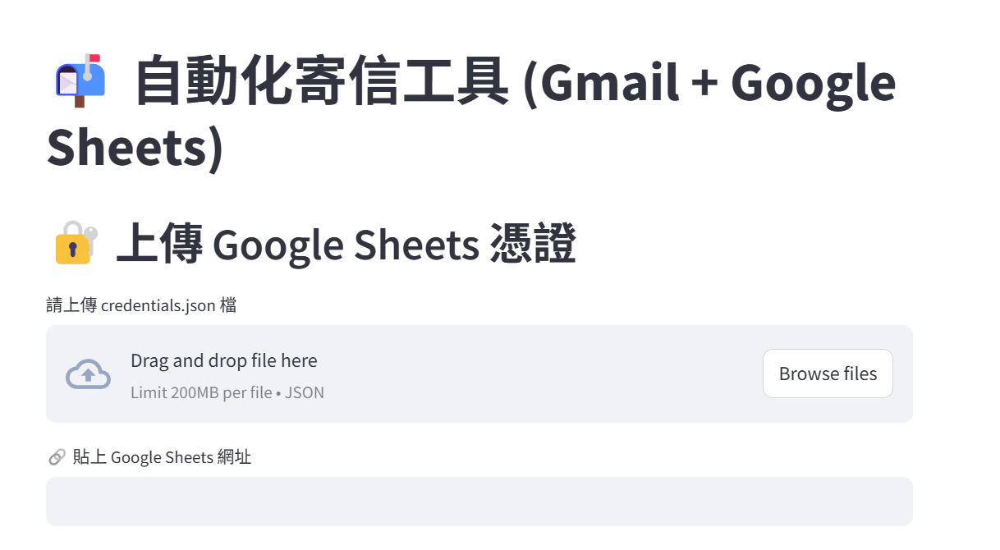

# 📬 SheetMail


> **Google Sheet mailing made dead‑simple.** Import a list from Google Sheets, batch‑send personalized Gmail messages (with optional attachments), and write the delivery status back—no server required.

<p align="center">
  <a href="https://youtu.be/yMJEbBpenPE" target="_blank">
    
  </a>
  <br><em>Click the image to watch the 51‑second demo on YouTube.</em>
</p>

---

## Features

- **Google Sheet → Gmail → Google Sheet** round‑trip: marks `Sent` + timestamp automatically.
- **Two entry points** – command‑line interface **(CLI)** and a **Streamlit** web UI.
- **Dry‑run mode** for safe rehearsals.
- **localtunnel** helper script for one‑click public demo links.
- **Zero cost**: relies only on Gmail App Password + Google Service Account.

---

## Requirements

| Software      | Notes                                |
| ------------- | ------------------------------------ |
| Python ≥ 3.9  | tested on 3.9-3.12                   |
| Gmail account | App Password enabled                 |
| Google Cloud  | Service‑Account & Sheets API enabled |

---

## Quick Start

```bash
# 1 Clone repository
$ git clone https://github.com/<you>/sheetmail.git && cd sheetmail

# 2 Create & activate virtual env
$ python -m venv venv && source venv/bin/activate  # Windows: venv\Scripts\activate

# 3 Install dependencies
$ pip install -r requirements.txt

# 4 Configure environment
$ cp .env.sample .env   # then fill values (see below)

# 5 Add your Service‑Account key
$ mv /path/to/your-key.json credentials.json
```

### `.env` example

```dotenv
SHEET_URL=https://docs.google.com/spreadsheets/d/XXXXXXXXXXXX/edit
SENDER_EMAIL=you@gmail.com
APP_PASSWORD=your_app_password
ATTACH_PATH=./assets/sample.pdf     # remove line to disable attachments
SENDER_NAME=Your Name
```

> **Important:** `APP_PASSWORD` **must** match `SENDER_EMAIL` and contain no leading/trailing spaces.

---

## Usage

### CLI

```bash
# rehearsal – nothing is actually sent
$ python cli.py --dry-run

# real run
$ python cli.py
```

### Web UI

```bash
# Local interface → http://localhost:8501
$ streamlit run app.py

# Local interface + public URL via localtunnel
$ python runner.py    # prints the public URL once ready
```

---

## Google Sheet schema

| A `Name`  | B `Email`     | C `Status` | D `Timestamp`    |
| --------- | ------------- | ---------- | ---------------- |
| Alice Lee | a@example.com | pending    |                  |
| Bob Chan  | b@example.com | Sent       | 2025‑04‑24 18:42 |

- Initialize **Status** as `pending`.
- Script sets `Sent` + timestamp (`Asia/Taipei`) after success.

---

## Frequently Asked Questions

| Issue                           | Fix                                                               |
| ------------------------------- | ----------------------------------------------------------------- |
| `Invalid Credentials`           | Sheet not shared with the service account or Sheets API disabled. |
| `SMTPAuthenticationError`       | Wrong App Password or 2‑factor not enabled.                       |
| Streamlit UI values not applied | Make sure you filled **all** fields before clicking **Send**.     |
| No localtunnel URL              | Rerun `runner.py` or check your firewall/proxy.                   |

---

## Contribution

1. Fork → branch → PR.
2. Ensure `ruff check` passes.
3. Cover new code with unit tests (pytest).

---

## License

MIT

---

### How the embedded video works

GitHub READMEs do **not** render YouTube iframes, but they will keep HTML `<a>` tags. The workaround above shows a clickable thumbnail that opens YouTube in a new tab. Prefer MP4 or GIF stored locally if you want fully offline docs.

```markdown
[](https://youtu.be/YOUR_VIDEO_ID "Watch the demo")
```

Replace `YOUR_VIDEO_ID` with the actual YouTube ID.

---

### Logo placement

Just drop your logo at `assets/logo.png` (or any path you like) and reference it at the top:

```markdown

```
